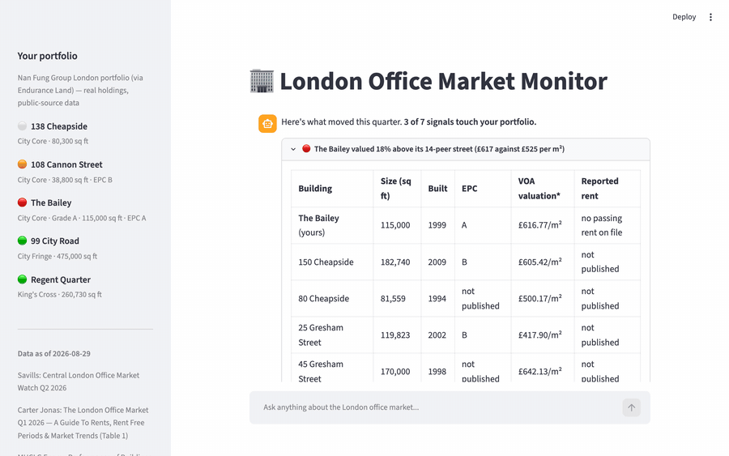

# 🏢 London Office Market Monitor

An AI agent that monitors the Central London office market for a commercial real
estate team. It opens with a briefing of what moved this quarter, filtered to the
buildings you actually hold, then answers follow-up questions with sourced figures.

Built on **Gemini 3.7 Flash** with function calling and Google Search grounding.

---

## Quick start

**Prerequisites:** Python 3.11+ and [`uv`](https://docs.astral.sh/uv/). If you don't have `uv`:

```bash
curl -LsSf https://astral.sh/uv/install.sh | sh
```

**1. Install dependencies**

```bash
uv sync
```

**2. Add your API key**

```bash
cp .env.example .env
```

Open `.env` and paste a Google AI Studio key into `GOOGLE_API_KEY`. Free keys are
available at [aistudio.google.com/apikey](https://aistudio.google.com/apikey).

**3. Start the server**

```bash
uv run streamlit run app.py
```

The app opens at **http://localhost:8501**. Press `Ctrl+C` in the terminal to stop it.

### Or in Docker

If you would rather not install Python and `uv` at all, `make start` builds an image
and serves the same app on the same port:

```bash
make build          # build the image
make start          # build, then run detached
make stop           # shut it down
```

The image builds on the pinned
[`uv` base image](https://github.com/astral-sh/uv-docker-example), installs from
`uv.lock` so the container resolves the wheels your laptop resolved, and runs as a
non-root user. Your key is passed in at run time from `.env` and never enters an
image layer — and with no `.env` at all the container still serves the full brief,
with chat switched off.

### Configuration

`GOOGLE_API_KEY` is the only variable you need. Two others in the same file are optional:

| Variable       | Default            | Purpose                                                                                        |
| -------------- | ------------------ | ---------------------------------------------------------------------------------------------- |
| `CRE_MODEL`    | `gemini-3.7-flash` | Swap models without touching code. `scripts/probe_models.py` lists the ones your key can reach |
| `CRE_THINKING` | `medium`           | `low`, `medium` or `high`. Lower is faster and cheaper                                         |

Your portfolio lives in `config/watchlist.yaml`; the shipped one is described
under **Data and attribution**. Add your own rents and lease dates to light up
the reversion column, or delete every asset: the market-wide view works
completely with an empty watchlist.

## Scope

A self-contained Python proof of concept, judged on one thing: the agent loop and
the tool calls under it. One command, one process, nothing to stand up. What that
bought, and what it cost.

**Chosen, with reasons**

- **No RAG, no vector store.** Figures live in a structured fact store
  (`src/cre_agent/store.py`) and reach the model through function calls. Chunk and
  embed the source PDF instead and a reversion stops being computable, an as-of
  date stops travelling with the number it belongs to, and an unpublished level
  gets a plausible one invented for it. The store is the reason every figure on
  screen can be traced; retrieval over prose would have made that promise
  unkeepable.
- **No API tier, no MCP server, no SPA.** Streamlit is the entire presentation
  layer and the agent runs in the same process — one entry point,
  `uv run streamlit run app.py`. A transport boundary would have added deployment
  surface and proved nothing about the loop.
- **No database server.** Everything loads from `data/seed_*.json` at startup —
  one file per source, 102 Facts and 27 events across nine sources. Read-only,
  in memory.
- **No observability stack** — no Langfuse, no tracing backend. Every tool call is
  expanded in the UI directly above the answer it produced, which at this scale
  serves the same purpose: you can see which figures were looked up, and which the
  agent declined to invent.
- **One primary market provider, plus open data.** Savills, Central London
  Office Market Watch Q2 2026, is the market spine; the VOA rating list, the
  EPC register, and Colliers/Carter Jonas/trade-press figures join it one seed
  file per source. Merging providers is a mapping problem rather than a loading
  problem — definitions and submarket boundaries differ — which is what
  `src/cre_agent/submarkets.py` is for: a controlled vocabulary with an explicit
  hierarchy, so an alias resolves upward to the node that actually holds facts.
  The same reasoning is why the sector vocabulary was dropped rather than guessed.
  Savills uses different cuts in different tables and never claims they are
  equivalent, and `Insurance & Financial` is not `Financial & Banking`.
- **A fixed strategy vocabulary.** Six decision verbs — `regear`, `refurbish`,
  `re-price`, `hold`, `defer capex`, `start the conversation` — declared in
  `src/cre_agent/signals.py`. They are assumed, not derived; a real portfolio team
  would own that list. What matters is that it is closed and built in Python, so
  a test can assert that "monitor" — the verb that lets a paragraph end without
  deciding anything — never appears. Held in the prompt instead, that could only
  be asked for.

**Not built, stated plainly rather than discovered**

- No automated data ingestion. The quarterly dataset was harvested once, by hand,
  by reading the published article and transcribing the figures. All 70 records
  were later re-checked against the source; see **Data and attribution**.
- One quarter of history, so trends are quoted from the source rather than computed.
  Q1 2026 is the obvious next harvest and would make quarter-on-quarter computed.
- Only the Streamlit layer is exercised by hand; everything under it is covered
  by tests and `evals/` (see **Tests and evals**).
- No authentication, no multi-user, no deployment pipeline. Local run only.

## Demo



The brief opens ranked and filtered to the buildings you hold — here 3 of 7 signals
touch the portfolio, led by The Bailey valued 18% above its 14-peer street.

Clicking **Is The Bailey priced right against its peers?** runs the whole loop in the
open. The tool panel logs every lookup it makes — `get_watchlist`, `compare_building`,
`get_signals` — and the answer is arithmetic rather than recall: £616.77/m² against a
£524.61/m² median across 14 named City Core buildings, a 17.6% gap worth £984,624 a
year of implied value above the street, carrying its source and as-of date. It is also
explicit about what it will not do — *0 reported peer lettings on file* — rather than
benchmark a valuation against a headline rent, and it closes on a verb from `ACTIONS`.

## Tests and evals

```bash
for t in tests/test_*.py; do uv run python "$t"; done
```

143 tests across six files. None needs an API key, a network or a test runner — they
are plain scripts, so there is nothing to install. Most guard failures that only appear
once a second quarter is merged: periods sorting by their string name, a metric changing
grain between reports, a detector subtracting two figures from different years, and two
sources publishing the same figure, where the newer `published` date wins rather than
whichever filename sorted first. One file guards the join: that a lease window opening in
July 2026 rejects a March 2026 break, that a `Fact` carrying a `None` level never has a
comparison built against it, and that a mistyped key in `config/watchlist.yaml` names
itself instead of raising a bare `TypeError` at import.
`test_agent_loop.py` drives `ask()` against a fake client returning real
`google.genai.types` objects: the final answer enters conversation history, tool rounds
round-trip in order, and a missing key degrades to a friendly error instead of a
traceback.

```bash
uv run python evals/run.py --n 3
```

The deterministic half is proven by tests; the model's half can only be measured. 33
canned questions run against the live model, graded programmatically: every figure in
an answer must appear in the tool traffic that produced it (or carry a web citation
and say so), macro questions must refuse or answer from the web labelled as such,
decision questions must close on the fixed verb vocabulary and never on "monitor",
and the two multi-turn cases hold the conversation-history round-trip against the
real API. Needs `GOOGLE_API_KEY`. A case fails the run only when it fails a majority
of its reps, so one flaky rep does not cry regression and a real one cannot hide.
Full transcripts land in `evals/runs/` for diffing after any prompt or model change.

## Data and attribution

Every figure carries its source and as-of date in the app. One seed file per
source, nine in `data/`:

| Source                                                                            | Provides                                                                                        | Loads as            |
| --------------------------------------------------------------------------------- | ----------------------------------------------------------------------------------------------- | ------------------- |
| **Savills**, Central London Office Market Watch Q2 2026 (published 6 August 2026) | the market spine — rents, vacancy, take-up, pipeline, sector cuts, named lettings               | 53 facts, 17 events |
| **VOA 2026 non-domestic rating list** (open, 2024 antecedent valuation date)      | building valuations in £/m², Canary Wharf and the City Core corridors                           | 47 facts            |
| **Non-domestic EPC register** and named public building records                   | the two peer rosters — floor area, completion year, whole-building EPC                          | 50 buildings        |
| **Colliers** (January 2026) and **Carter Jonas** (Q1 2026)                        | Canary Wharf vacancy and prime rent, each at its own older as-of date                           | 2 facts             |
| **Trade press**, cited event by event                                             | events on the Canary Wharf estate and on the holdings (OpenAI's 88,500 sq ft at Regent Quarter) | 10 events           |
| **Endurance Land / Nan Fung** public portfolio                                    | the watchlist itself                                                                            | 5 holdings          |

The Savills report is reproduced here for a non-commercial proof of concept; in
production this dataset would come from a licensed feed. Live web results come
from Google Search grounding and are labelled separately from stored figures,
because they carry different confidence.

The portfolio in `config/watchlist.yaml` is **real** — 138 Cheapside, 108 Cannon
Street, The Bailey, 99 City Road and Regent Quarter, the five London holdings of
Nan Fung Group through its wholly-owned development platform Endurance Land.
Every field carries a public source, named in the asset's note. The rent roll —
passing rents, breaks, expiries — is not public, and is deliberately absent
rather than invented.

**Provenance, stated plainly.** All of it was harvested by hand on 29 August
2026; there is no scraper to inspect.

- **Savills.** savills.co.uk returns HTTP 403 to ordinary HTTP clients, so the
  article was read in a browser and transcribed into `data/seed_2026Q2.json`. All
  70 source records were re-read against the source that day; no discrepancies
  were found. One field is an inference rather than a quote: Anthropic's letting
  at 1 Triton Square is tagged to North of Oxford Street East, which is correct
  but is not stated in the article.
- **VOA.** Computed from the official bulk download (~2 million hereditaments for
  England and Wales), sliced to E14 and to the Cheapside/Gresham/Wood Street, Old
  Bailey/Ludgate/Fleet Place and Cannon Street corridors, restricted to office
  descriptions, matched to buildings by street name and number, then aggregated
  as aggregate rateable value over aggregate floor area — area-weighted, because
  serviced-office operators fragment buildings into micro-suites that would
  dominate an unweighted median. Three of the holdings sit in that same list, so
  both sides of the peer comparison come from one dataset. What did not match is kept
  as an absence rather than a guess: three Canary Wharf towers, an
  un-attributable Ludgate Hill block, and 99 City Road, which holds no assessment
  at all while stripped for redevelopment. Each file's `_method` key records the
  rule and its matching traps; the raw download was deleted, and the harvest is
  repeatable from the URL in the source block.
- **Rosters and portfolio.** EPC ratings were read building by building from the
  public find-energy-certificate register (certificate numbers in the roster
  notes); sizes and ages come from the records each row cites. The Colliers and
  Carter Jonas figures were checked against the publishers' own PDFs, which
  corrected two mis-attributions a search snippet had suggested. The portfolio was
  crawled from `enduranceland.com/portfolio` and cross-checked against nanfung.com
  and 2024–26 trade press: all five holdings verified held, with one unresolved
  signal — a paywalled September 2025 Green Street headline about a marketed
  "£140m Holborn trophy" — recorded as a caveat rather than an event, because the
  building it concerns cannot be identified.
